# Results: Tabular RL Methods for TSP Navigation

## Experimental Setup

Four tabular RL algorithms were evaluated on a navigation variant of the Travelling Salesman Problem: **SARSA**, **Q-learning**, **Double Q-learning** and **n-step SARSA (n=20)**.

Training ran for **200,000 episodes** across four problem sizes: **N = 5, 10, 15, 20** intermediate points. A fixed random seed (42) was used throughout. Hyperparameters: α = 0.1, γ = 0.99, ε decaying from 1.0 to 0.05 at rate 0.99995.

---

## Algorithm Comparison by Number of Points

### N = 5

All four algorithms converge to nearly identical final performance (moving average reward ≈ 1.90–2.0). No meaningful differences in speed or stability are visible. The state space is small enough that any tabular method saturates it — algorithm choice is irrelevant here.

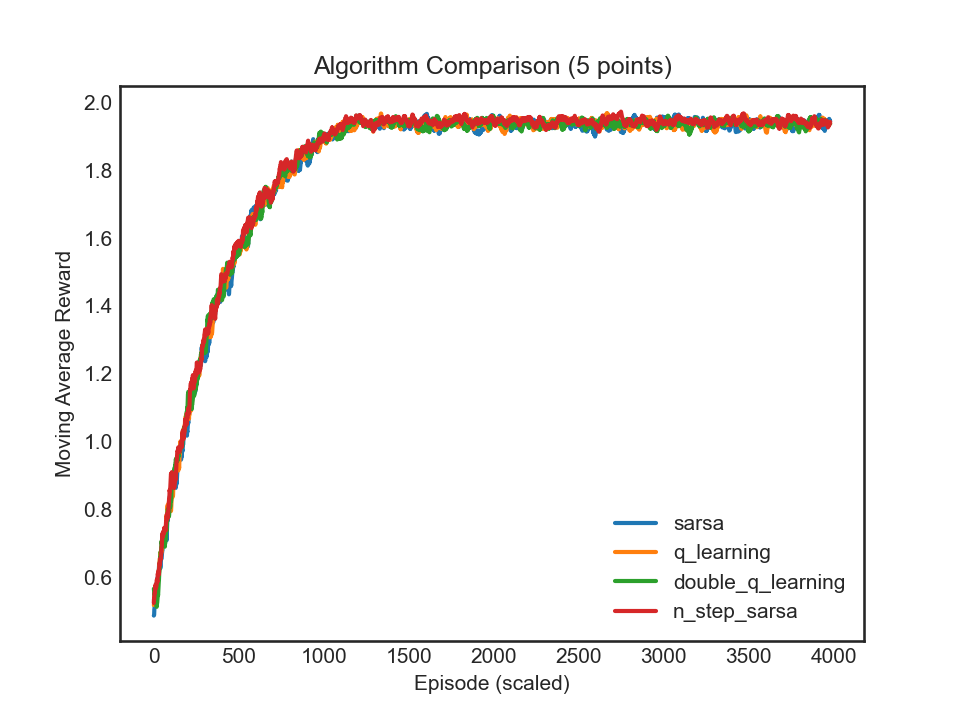

---

### N = 10

Separation between algorithms is visible from around episode 500. **Q-learning**, **SARSA** and **n-step SARSA** reach a higher plateau (~1.62–1.65). **Double Q-learning** performs worst at ~1.40. All methods start from negative reward and recover within ~500–1000 episodes.

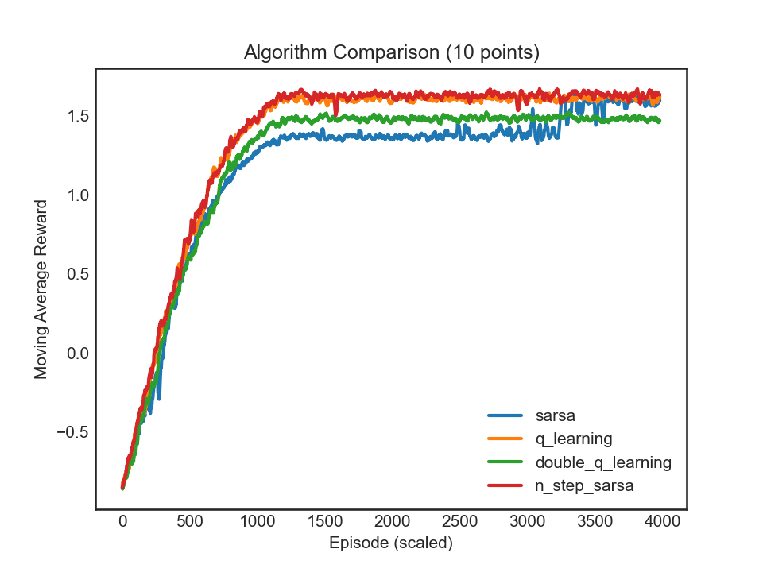

---

### N = 15

Differences are pronounced. **Q-learning** achieves the best final performance (~1.10), followed by **SARSA** (~1.0). **n-step SARSA** converges smoothly from the start but plateaus at a lower level (~0.75). **Double Q-learning** remains stuck near strongly negative rewards until around episode 3200, then jumps sharply to ~0.75. SARSA and Q-learning both show an abrupt transition from negative to positive rewards around episode 1200–1500 — the policy appears to cross a threshold where full tours become reliably completable.

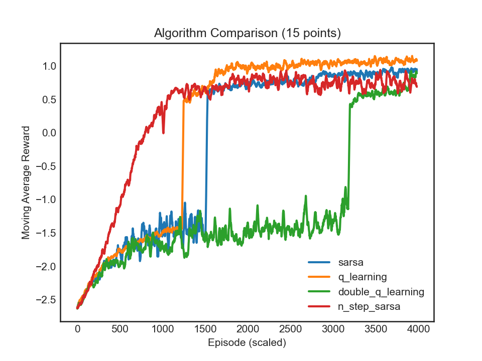

---

### N = 20

**n-step SARSA** is the clear winner. It reaches a plateau around −1.0, while SARSA, Q-learning, and Double Q-learning all remain near −3.5. The three single-step methods show only marginal improvement over 200,000 episodes and effectively fail to learn a competitive policy within the episode budget.

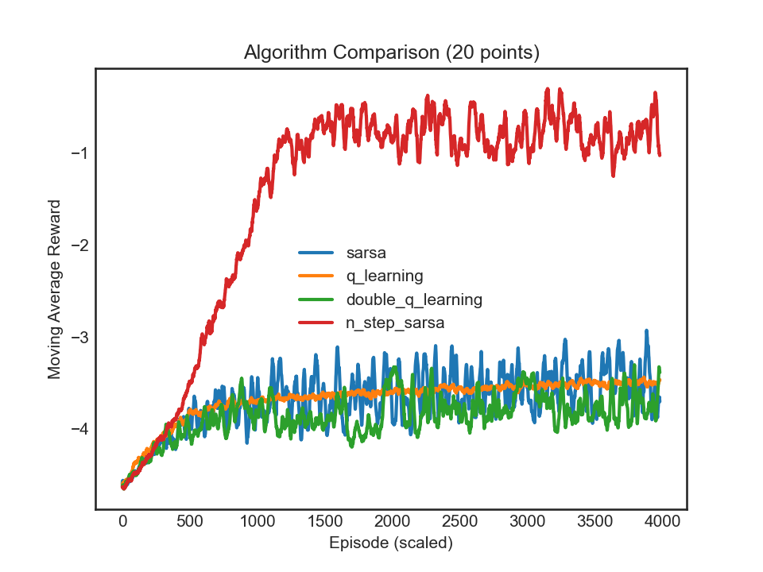

---

## Performance Across N per Algorithm

### SARSA

Converges cleanly for N = 5 and N = 10. For N = 15, a sharp jump occurs around episode 1500, after which it stabilizes at ~1.0. For N = 20, it plateaus near −3.5 with high variance — the policy shows little improvement beyond chance-level tour completion.

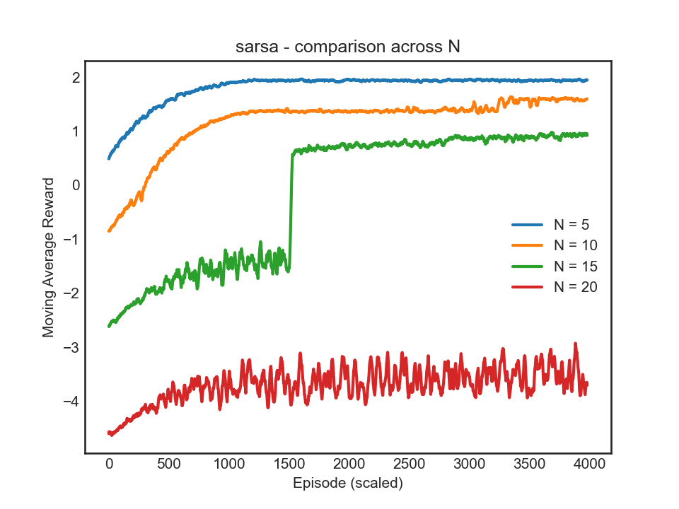

---

### Q-learning

Mirrors SARSA for N = 5 and N = 10, but achieves better final performance at N = 15 (~1.1 vs ~1.0). At N = 20, it is marginally better than SARSA but still far from a working solution. The abrupt transition at N = 15 is present here as well, though convergence after the jump is smoother.

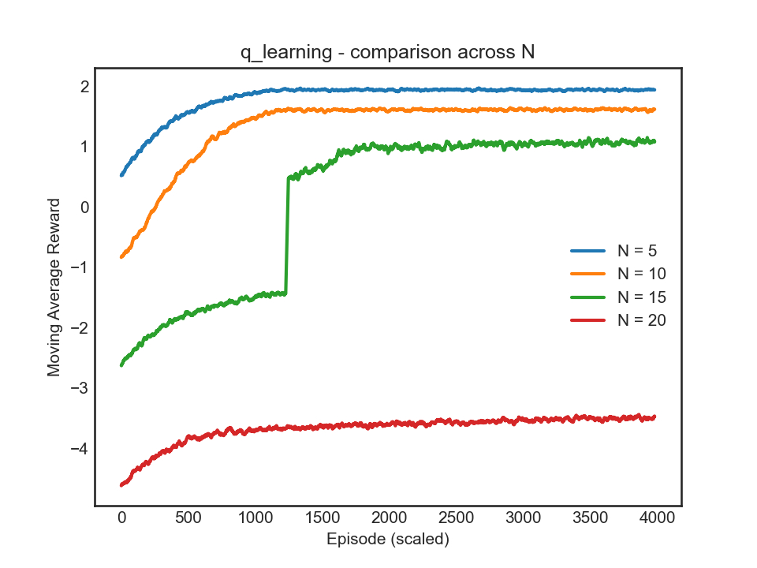

---

### Double Q-learning

Comparable to the other methods for N = 5 and N = 10. At N = 15, it shows the most delayed convergence — the policy remains near −1.5 for over 3200 episodes before jumping to ~0.75. Maintaining two Q-tables appears to slow policy improvement in larger state spaces. At N = 20, it shows the highest variance of the single-step methods and does not converge.

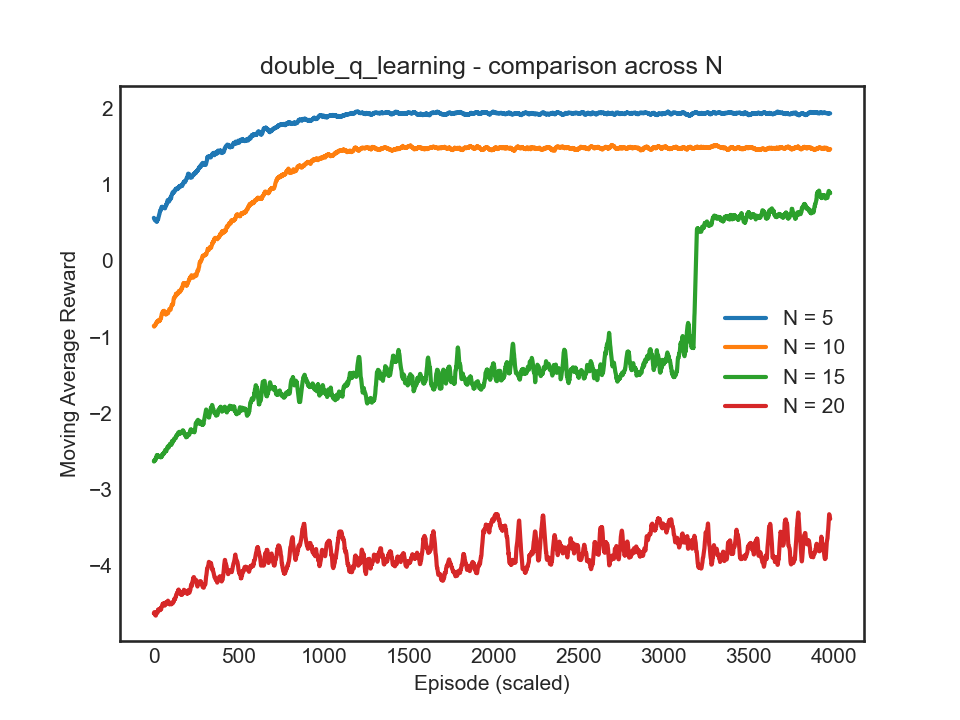

---

### n-step SARSA (n = 20)

The most consistent algorithm across all N. For N = 5, 10 and 15, convergence is smooth with no abrupt transitions. At N = 20, it is the only method that achieves meaningful improvement (~−1.0). The final plateau at N = 15 (~0.75) is lower than Q-learning and SARSA, despite converging earlier and more stably.

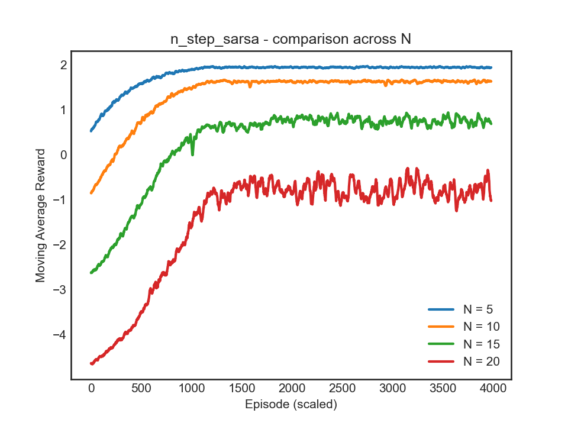

---

## Final Routes

### N = 5 — SARSA

The learned route visits points in a spatially logical progression with no crossings. The tour appears near-optimal for this configuration.

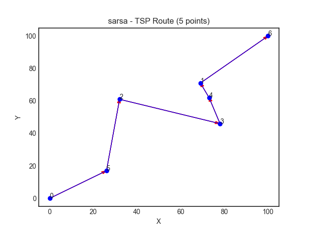

---

### N = 20 — n-step SARSA

With 20 points, some backtracking and crossings are present. Overall, the route covers the workspace in a rough diagonal sweep, visiting local clusters together. Quality is roughly comparable to a greedy nearest-neighbor heuristic — not optimal, but substantially better than random.

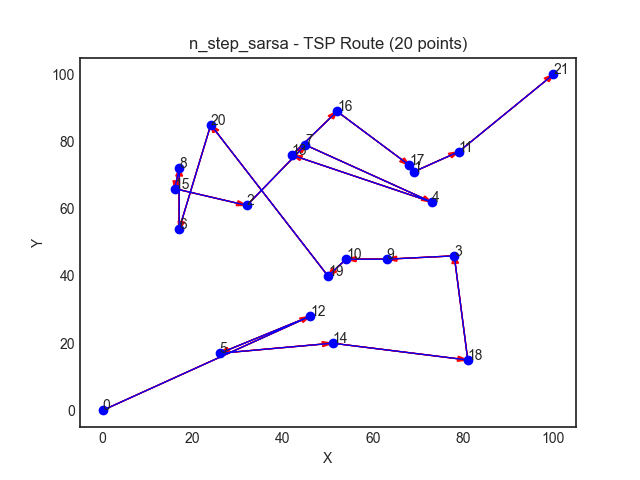

---

### N = 20 — Q-learning

More backtracking and long cross-workspace jumps compared to n-step SARSA, consistent with the much lower reward. The agent completes the tour but visit order is poorly optimized.

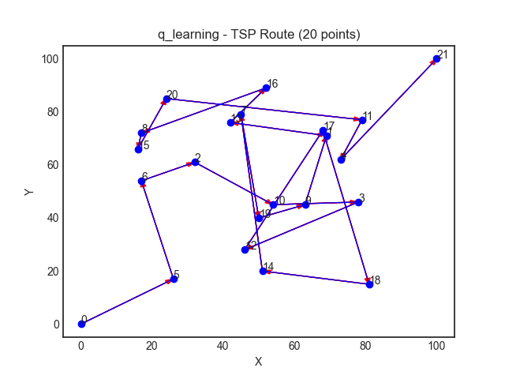

---

## Hyperparameter Analysis (N = 20)

### Effect of epsilon decay on Double Q-learning

All three tested decay rates (0.9999, 0.9997, 0.9995) yield nearly identical results — unstable curves hovering near −3.5 to −4.0. The bottleneck at this scale is not exploration scheduling. Single-step updates simply cannot propagate credit over tours of this length within the training budget.

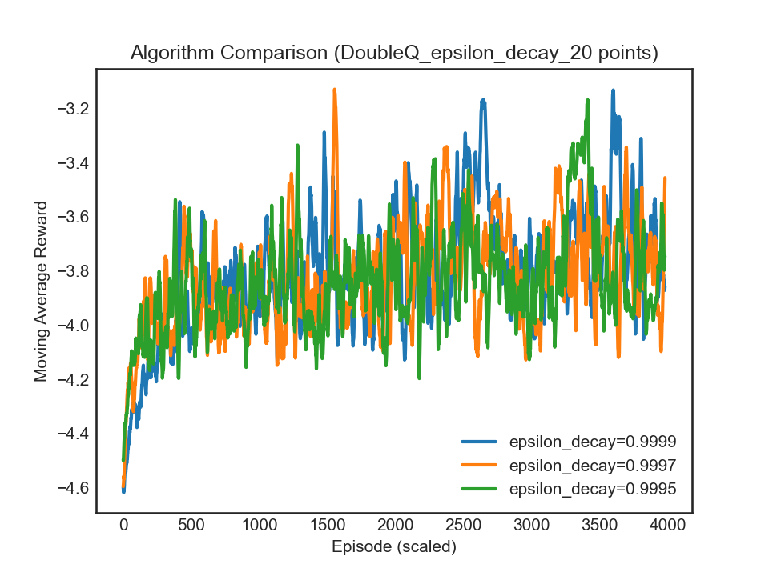

---

### Effect of learning rate on Double Q-learning

Learning rates of 0.2, 0.1, and 0.05 all produce similarly unstable curves near −3.5, with no meaningful difference in final performance. This reinforces the conclusion that the failure of Double Q-learning at N = 20 is structural rather than a tuning issue.

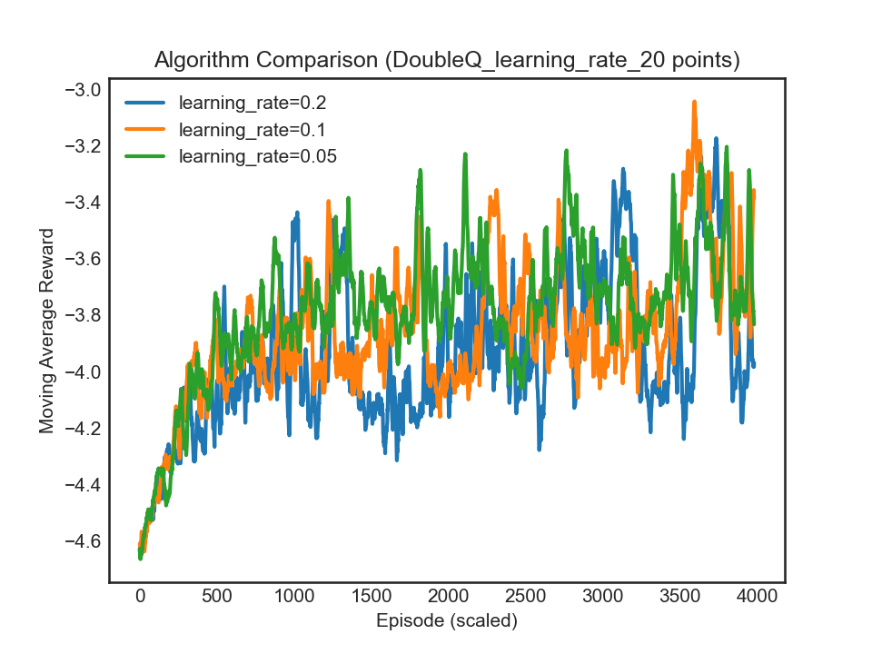

---

### Effect of epsilon decay on n-step SARSA

Here epsilon decay does matter. Faster decay rates (0.9997, 0.9995) converge around episode 500 and stabilize near −1.0. The slowest rate (0.9999) converges later (~episode 700) but reaches a comparable final level. Faster decay accelerates convergence without hurting final performance.

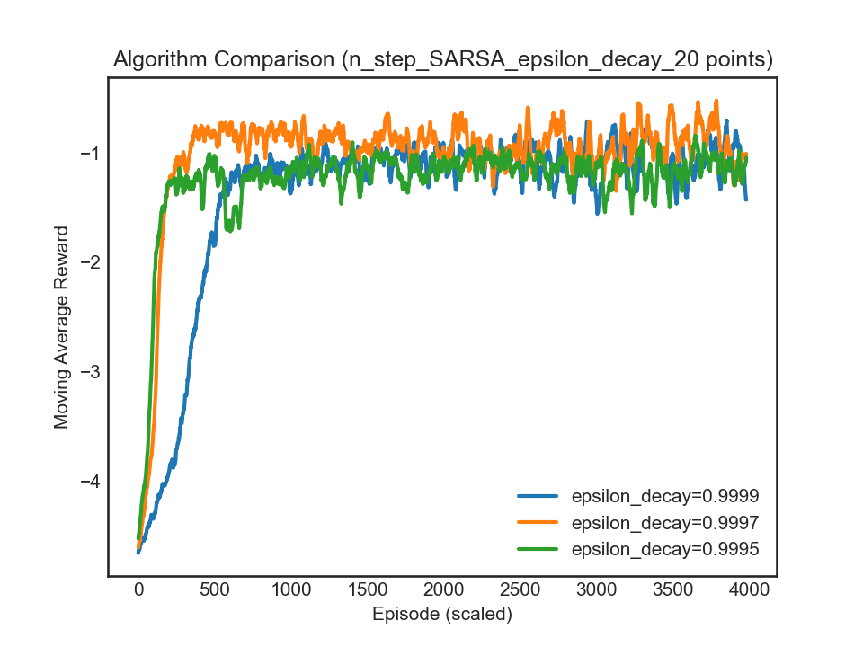

---

### Effect of learning rate on n-step SARSA

All three rates (0.2, 0.1, 0.05) converge to a similar plateau near −1.0. α = 0.2 produces a noisier curve but catches up by the end of training. Overall the algorithm is robust to learning rate choice within this range.

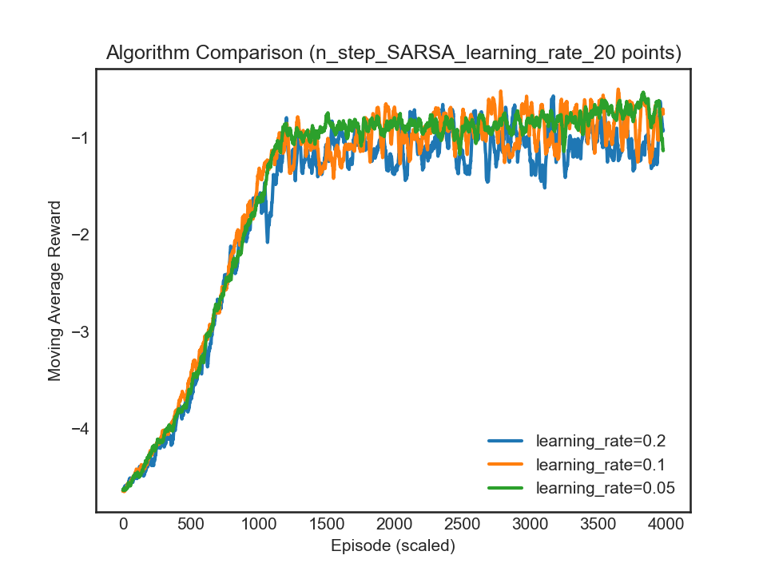

---

### Effect of n on n-step SARSA (N = 20)

All three values (n = 10, 15, 20) reach a similar final reward (~−0.9 to −1.0) at roughly the same rate. Any n ≥ 10 appears sufficient to capture the benefit of multi-step returns for this problem size.

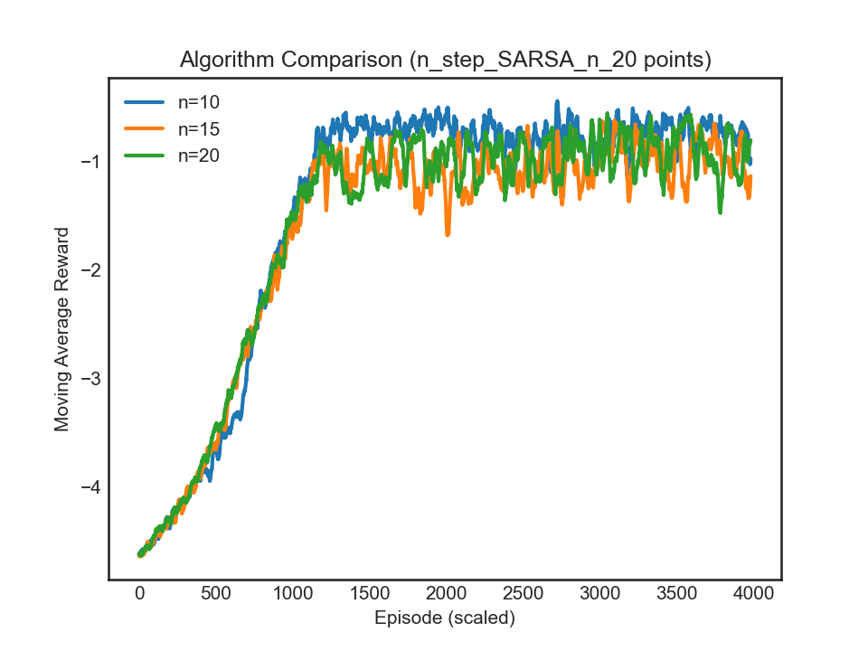

---

## Summary of Observations

**N = 5:** All algorithms equivalent. Trivially solvable by any tabular method.

**N = 10:** Q-learning, SARSA and n-step SARSA pull ahead (~1.62–1.65). Double Q-learning is intermediate (~1.48). 

**N = 15:** A clear difficulty threshold. SARSA and Q-learning show abrupt mid-training jumps; n-step SARSA converges smoothly but to a lower final value. Q-learning achieves the best result (~1.10). Double Q-learning is the slowest to converge, jumping only after episode 3200.

**N = 20:** n-step SARSA dominates, reaching ~−1.0 while single-step methods stall near −3.5. Hyperparameter tuning has negligible effect on Double Q-learning. For n-step SARSA, faster epsilon decay modestly accelerates convergence.

The main takeaway: **multi-step returns become increasingly critical as problem size grows**. For small N the algorithm choice does not matter; for large N it is decisive.